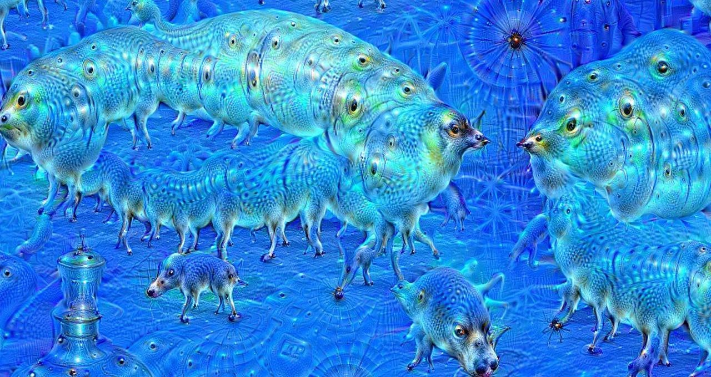
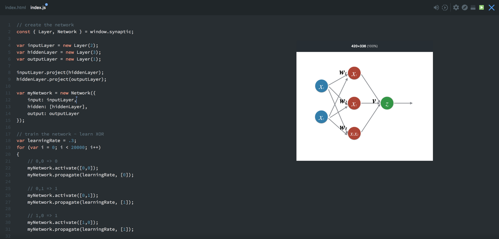
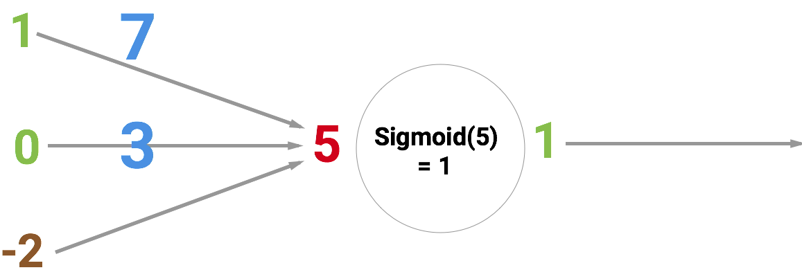
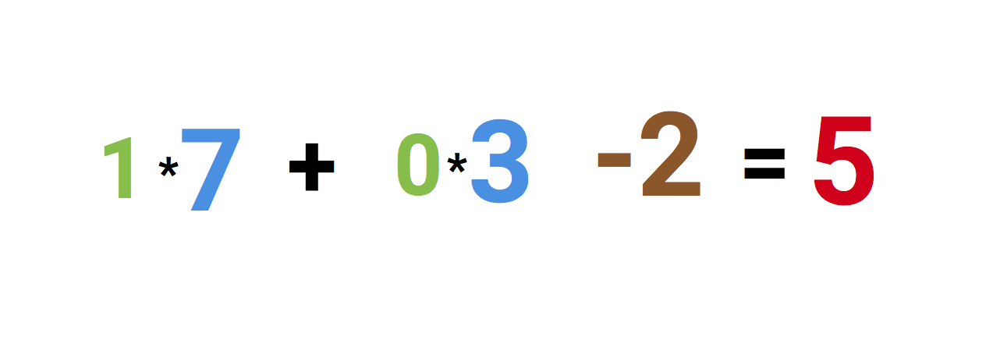
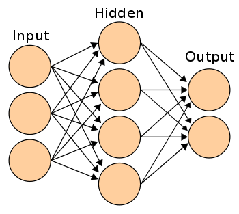
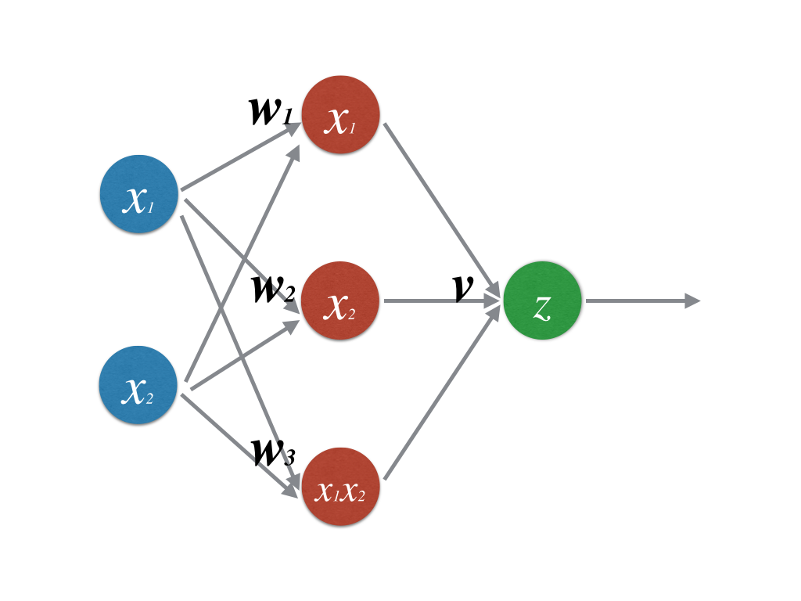

# 如何用小于30行 JavaScript代码创建一个神经网络

    一个由 Google Dream 神经网络创建的奇异景观

在这篇文章中,我会向你演示如何用[Synaptic.js](https://synaptic.juancazala.com/#/)(一个可以允许你在Node.js和浏览器中做深度学习的第三方库)创建和训练一个神经网络.

我们会创建一个可能是最简单的神经网络 -- 一个可以解决[XOR等式](https://en.wikipedia.org/wiki/Exclusive_or)的神经网络.

我已经在这个例子的基础上创建了一个交互的Scrimba教程,现在同样可以查看.

在这个Scrimba教程,你能够随意按照你的想法进行修改.

但是在此之前.我们先看我们的代码,让我们一起看看这个最基础的神经网络吧.

## 神经元和突触

神经网络最先建立的一部分就是神经元.

一个神经元就像一个函数,它接收几个输入,并返回输出.
这里有许多不同类别的神经元.我们神经网络的目的就是去使用sigmoid节点,sigmoid节点可以接收任意的数字,并把这
个数字压缩到0和1之间.

下面的文章就演示sigmoid节点.节点的输入为5,他的输出是1. 这些箭头叫做突触,它可以连接神经员到网络的其它层.

所以为什么是红色的数字5?因为5是左边三个连接到神经元的突出的和.让我们展开的看一下.

在最左边我们可以看到两个值和一个被叫做偏置的值. 输入的值1和0为绿色, 棕色的-2为偏置.

首先,两个输出的值乘以他们的权重,分别由蓝色表示的7和3.

最终我们把乘积和偏置加起来,得到结果5.这就是输入在经过我们人工神经元之后的结果.

然而,这是一个可以把任意值压缩到0到1之间的sigmoid节点.这个结果被压缩到1.

如果你把这些神经元链接起来,你就有了一个神经网络.这个由输入经过神经元到输出的正向传播被突触连接起来.如下图所示.
    

这个神经网络的目的是去训练这个神经网络以完成泛化的任务,比如识别识别手写数字或者垃圾邮件. 有一个好的泛化能力的关键在于在神经网络内部有正确的权重和偏置.就像我们在之前图中蓝色和棕色的数字.

当训练这个网络的时候,你只是看网络加载像手写数字,用神经网络去预测正确回答的样本.

在每一步预测之后,你看可以计算每一个预测的偏差有多少,这样就可以去调整权重和偏置了.在调整过后,神经网络下次就可以预测的误差更小了.这种自学习的方式成为反向传播.重复相同的步骤很多很多次.你的神经网络就会在泛化/归类这种任务上表现良好.

反向传播在数学上是如何实现的已经超出这个教材的领域.但是仍有我找到用于理解反向传播的好资源.

[A Step by Step Backpropagation Example](http://mattmazur.com/2015/03/17/a-step-by-step-backpropagation-example/) -- by [Matt Mazur](https://medium.com/@mhmazur)

[Hackers Guide to Neural Nets ](http://karpathy.github.io/neuralnets/) -- by [Andrej Karpathy](https://medium.com/@karpathy)

[NeuralNetworksAndDeepLarning](http://neuralnetworksanddeeplearning.com/chap1.html) — by [Michael Nielsen](https://twitter.com/michael_nielsen)

## 编码实现

现在你已经了解相关基础.让我一起去编码实现.最开始的第一件事我们需要去创建一个层.我们用Synaptic中的`new Layer()`函数去创建.函数传入的参数代表着每层应该带有的神经元数量.
如果你对什么是**层**还比较迷惑,查看[screencast](https://scrimba.com/casts/cast-1980).

`const { Layer, Network } = window.synaptic;
var inputLayer = new Layer(2);
var hiddenLayer = new Layer(3);
var outputLayer = new Layer(1);`

接下来我们就可以把所有层连接起来,实例化一个新的网络,就像这样

`inputLayer.project(hiddenLayer);
hiddenLayer.project(outputLayer);
var myNetwork = new Network({
 input: inputLayer,
 hidden: [hiddenLayer],
 output: outputLayer
});`

这就是一个2-3-1的网络,用可视化可以表示成下面的样子

现在我们去训练这个网络.

`// train the network - learn XOR
var learningRate = .3;
for (var i = 0; i < 20000; i++) {
  // 0,0 => 0
  myNetwork.activate([0,0]);
  myNetwork.propagate(learningRate, [0]);
  // 0,1 => 1
  myNetwork.activate([0,1]);
  myNetwork.propagate(learningRate, [1]);
  // 1,0 => 1
  myNetwork.activate([1,0]);
  myNetwork.propagate(learningRate, [1]);
  // 1,1 => 0
  myNetwork.activate([1,1]);
  myNetwork.propagate(learningRate, [0]);
}`

现在我们训练了这个网络20,000次.每次我们都正向和反向传播四次.传递四个可能的值到这个网络:`[0,0] [0,1] [1,0] [1,1]`.

我们从做`myNetwork.activate([0,0])`,其中,`[0,0]`是我们最先输入给网络的值.这就是正向传播,也被叫做网络的激活.在每次正向传播之后,我们需要反向传播去更新神经元的权重和偏置.

反向传播通过`myNetwork.propagate(learningRate, [0])`这一行代码实现.`learningRate`是一个常量,它告诉神经网络每次调整权重多少.第二个参数`[0]`代表在当前输入为`[0,0]`前提下的输出结果.

**之后神经网络对比自己的预测和正确标签.这能够较好的反映预测结果的好坏**

利用这个比较去调整权重和偏置的值,下次我们就可得到一个更加接近的值.

在重复了20,000次之后,我们可以拖过激活网络来查看我们网络的四个可能输出来评价网络效果好坏.
`console.log(myNetwork.activate([0,0])); 
-> [0.015020775950893527]
console.log(myNetwork.activate([0,1]));
->[0.9815816381088985]
console.log(myNetwork.activate([1,0]));
-> [0.9871822457132193]
console.log(myNetwork.activate([1,1]));
-> [0.012950087641929467]`

如果我们将这些数字舍入整数,我们可以得到XOR等式的正确解答.

这就是我们所说的.即使我们只了解了神经网络的表面,这个应该足够让你自己开始使用Synatptic,然后继续自学.项目的wiku包含了许多优秀的教程.

最终,希望你能通过投屏或者文章来分享你在学习新事物时的点滴.

