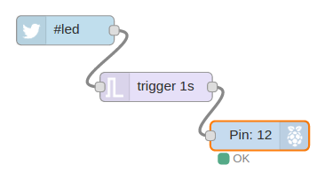
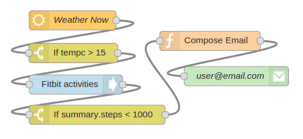
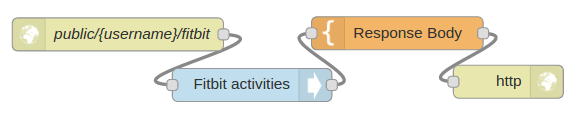
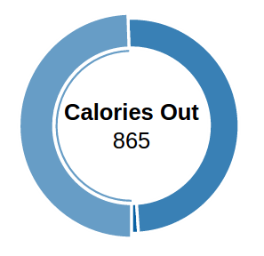

# Node-RED Tutorial 1 -- 简介

  这一章将会向您介绍一些Node-RED的样例，让了解了Node-RED功能的同时又介绍它的基本概念，我们还将讨论Node-RED的历史及其起源，以便让您了解Node-RED所擅长的灵域以及对于相对传统的编程语言和环境具有哪些优势，何种类型的项目(任务)才是最适合Node-RED的。到本课结束时，您应该对Node-RED、其编程模型和一些简单的预构建节点有一个深层次的理解，并深入了解Node-RED的起源和最佳用法。
  Node-RED是构建物联网应用程序的一个强大工具，其重点是简化代码块的"连接"以执行任务。它使用可视化编程方法，允许开发人员将预定义的代码块（也叫做"节点"）连接起来执行任务。连接的节点，通常是输入节点、处理节点和输出节点的组合，当它们连接在一起时，构成一个"流"。最初是IBM在2013年末开发的一个开源项目，以满足他们快速连接硬件和设备到Web服务和其他软件的需求--作为物联网的一种粘合剂--它很快发展成为一种通用的物联网编程工具。重要的是，Node-RED已经迅速开发出一个重要的、不断增长的用户基础和一个活跃的开发人员社区，他们正在开发新的节点，允许程序员重用Node-RED色代码来完成各种各样的任务。
虽然Node-RED最初是用来处理物联网的，也就是说，它是与现实世界交互和控制的设备，但随着它的发展，它已经成为一系列应用的有用工具。

## 认识	Node-RED
让我们从几个简单的例子入手，看看可以用Node-RED来做的事情。我们讲解的目的不是让您用Node-RED编程，而是通过一些高难度的例子让您对它的能力有所了解。如果您真的想直接深入了解，您可以跳到第2课，在那里您将通过创建和运行您的第一个流的步骤。
第一个例子流将收到包含标签的推特信息，打开和关闭LED时，便收到了一个新的推特。在这个例子中我们假设node-red在Raspberry Pi中的运行--一种对Node-RED用户来说常用的环境
实例1.1使用推特控制Raspberry Pi
这个Node-RED流检查推特并检测# LED标签是否连接，打开LED接π如图1.1所示。
如您所见，非常简便，它由三个节点连接在一起-左边的Twitter节点，中间的触发节点以及右侧的Raspberry Pi （gpio）节点（GPIO代表通用输入/输出给出通用的Raspberry Pi的节点处理IO的名字）。由圆形框表示的节点通常有一个图标来表示它们的类型，例如第一个节点中的Twitter鸟图标和一个可以由程序员设置的文本名称。
	这三个节点中的每一个都被构建到Node-RED可视化编程工具中，并可以从一个节点调色板拖到主工作区。然后通过将输出选项卡连接到流中下一个节点的输入选项卡（节点框右边或左边的小灰点）来连接它们，下一个讲座将详细讨论UI，但现在让我们把重点放在高级功能上。
	
 

图1.1（简单的三个节点，在Raspberry PI环境中使用Twitter触发LED）

Twitter节点是Node-RED的内置节点，隐藏了使用Twitter API的所有复杂性。它可以设置用户账号的信息和搜索各种字符串，我们只需要简单的搜索标签#LED。
	当Twitter节点在对用户的推文或者公共推送中看到标签时，它会创建一条新消息，其中包含推送的全部信息，该消息转发到流中的下一个节点。在我们的示例中，由于Twitter节点的输出连接到trigger节点的输入，从而trigger节点可以接收消息中的详细信息。
trigger节点是Node-RED中的另一个内置节点，其默认行为是等待其接受到的任何消息。当它收到一条消息时，它就会触发，并在其输出上以值为"1"作为消息体发送消息。然后等待1秒，并在消息正文中发送值为"0"的第二条消息。
  由于trigger节点连接到控制输入/输出或IO的Raspberry Pi引脚的GPIO节点，1秒之后在它的输入引脚得到的这两个消息。
其次，gpio节点是隐藏设置IO Pi引脚的细节一个Node-RED内置的节点。当它获得一个具有"1"值的消息时，它将IO引脚pin调高，当它接收到一个带有"0"体的消息时，它将PIN调低。在这个例子中，该gpio节点配置控制引脚数12，所以节点数显示在图标中。
  如果您的Pi引脚优先连接LED灯并且Pin设置为12，则LED灯会一秒钟闪烁一次。
  如果您仔细想想发生了什么，它实际上是一个极其强大的Node-RED和物联网的例子。它是将Twitter文章连接到PI和LED，但不需要任何编程-所有的任务都是通过预先进行了节点在Node-RED，只需要设置即可。这展示了了Node-RED在一个简单的设备上比如Raspberry PI运行的能力。

  所以我总结一下。Node-RED是一种基于流的编程工具，它有一个可视化编辑器，允许您将节点连接在一起以创建流。在这种情况下，3个节点创建我们的第一流。真实世界的事件，例如将带有# LED标签的Twitter转换为信息，通过流中连线传输数据。节点在其输入口中处理消息，并且将其输出的消息发送到流中的下一个节点。在这个简单的例子中，我们寻找一个带标签# LED的Twitter和用它来触发消息到Raspberry Pi节点，导致IO引脚12高1秒，这将导致LED闪烁1秒。
这个例子--以及本课的其他部分--主要是向大家展示我们可以用Node-RED来做的事情。如果您想尝试这个例子，您应该看看第2课，看看如何设置一个帐户与FRED（基于Node-RED的能够使用的云服务），以及如何开始。
这个流的详细信息

`[{"id":"5392b19a.ac6d5","type":"twitter in","twitter":"","tags":"#led","user":"true","name":"","topic":"tweets","x":226,"y":162,"z":"4539e432.bac61c","wires":[["d5c9e9c9.2a3618"]]},{"id":"21fdbdaa.de0242","type":"rpi-gpio out","name":"","pin":"12","set":"","level":"0","out":"out","x":424.99998474121094,"y":270,"z":"4539e432.bac61c","wires":[]},{"id":"d5c9e9c9.2a3618","type":"trigger","op1":"1","op2":"0","op1type":"val","op2type":"val","duration":"1","extend":false,"units":"s","name":"","x":319,"y":220,"z":"4539e432.bac61c","wires":[["21fdbdaa.de0242"]]}]`

  我们的第二个例子显示Node-RED不同的用法。不是控制设备例如Raspberry Pi，这个流会结合气象信息和您的Fitbit信息，当天气好且您落后于您的锻炼计划时会向您发送电子邮件警报。这个流有点复杂，使用6个节点，但依旧通过使用内置节点，您仍可以通过很少或没有编程来完成复杂的任务。
 
	和以前一样，节点从Node-RED UI的节点调色板中拖出来，并在主界面上连接在一起。从最左边的节点，让我们开始一个openweather节点可以配置检查设定的时间间隔在任何主要城市天气。当它检查时，它会将结果打包到一个消息中，该消息被发送至下一个节点，在这种情况下，是指向一个switch节点。switch节点执行一个简单的测试，检查输入消息的值，若测试的值规范且正确，则发送一个值为"1"的消息。在我们的例子中，它被配置为检测温度值（tempc）是否为15摄氏度或更高。
当switch节点测试为真，或'switches on'状态，它发送一个消息到Fitbit节点--流程中的下一个节点。Fitbit节点是另一个强大的内置的节点，您可以在Fitbit.com网站的门户网站中设置获得您的Fitbit设备统计。Fitbit为您的设备将数据打包到一个消息中并将其发送到的流的下一个节点。
下一个节点是另一个switch节点。此项已设置成检查您今天走过的步数是否小于1000个。它通过检测Fitbit数据场中的summary.steps是否小于1000。记住，它是从一个向Fitbit.com申请信息的Fitbit节点中刚刚得到这些数据。
如果您今天走了不到1000步，那么switch节点会生成一条消息，该消息通过流传递给function节点。function节点是一个通用的内置节点，允许您用JavaScript编写自己的函数。下节课将更详细地讨论这个节点。现在，您可以假设这个节点刚刚创建了一个新的信息，信息的主题行和文本正文可以通过电子邮件发送。
一旦这个消息在function节点中创建，它就通过流发送到最终节点，这是一个email节点。此节点将接收任何传入消息的主体，并将其发送到在初始化节点时配置的电子邮件帐户。在这种情况下，设置成发送消息给您。
虽然例子似乎很简单，只是看看天气和您在Fitbit上的活动，您可以用类似的流检查家庭设备的状态，在您的服务器计算机，在一个工厂等设备，然后您可以使用输出节点发送邮件，Twitter，使用应用程序接口调用后台软件，控制设备-事实上选择是非常多的。Node-RED是一个非常强大的工具，用于连接输入和输出，并提供许多节点，无论是由Node-RED内置或开发，均可执行一系列惊人的任务。
您可以在以下片段中找到这个流的Node-RED信息：
`[{"id":"78902106.876fe","type":"function","name":"Compose Email","func":"return {\n    topic:\"The weather is good.\",\n    payload:\"Time to go for a walk!\"\n};\n","outputs":1,"noerr":0,"x":597.0000152587891,"y":441.9999084472656,"z":"c211e0ba.3dee2","wires":[["2e121645.d1edea"]]},{"id":"3c06c7e1.c3f938","type":"fitbit","fitbit":"","name":"","dataType":"activities","x":389.0000305175781,"y":510,"z":"c211e0ba.3dee2","wires":[["1e739b5.fe18c65"]]},{"id":"45a12686.ba5ed8","type":"switch","name":"If tempc > 15","property":"payload.tempc","rules":[{"t":"gt","v":"15"}],"checkall":"true","outputs":1,"x":385.0000190734863,"y":460.9999694824219,"z":"c211e0ba.3dee2","wires":[["3c06c7e1.c3f938"]]},{"id":"1e739b5.fe18c65","type":"switch","name":"If summary.steps < 1000","property":"payload.summary.steps","rules":[{"t":"lt","v":"1000"}],"checkall":"true","outputs":1,"x":421.9999885559082,"y":556.9999694824219,"z":"c211e0ba.3dee2","wires":[["78902106.876fe"]]},{"id":"2e121645.d1edea","type":"e-mail","server":"smtp.gmail.com","port":"465","name":"user@email.com","dname":"","x":638.0000152587891,"y":496.9999694824219,"z":"c211e0ba.3dee2","wires":[]},{"id":"bbb34414.444cb8","type":"openweathermap in","name":"Weather Now","lon":"","lat":"","city":"Vancouver","country":"Canada","x":384.0000190734863,"y":410,"z":"c211e0ba.3dee2","wires":[["45a12686.ba5ed8"]]}]`

我们在这个高级介绍中的最后一个例子是另一类流。它显示了如何创建一个简单的Web服务响应浏览器因数据查询所发送的一个HTTP请求，然后提供一个用图形表示数据的网页返回给浏览器-基本上Node-RED仅仅用了几个节点便提供了一个Web服务器和一些简单的服务。
加入之前介绍的Fitbit节点，这个例子创建了一个简单的Web服务，可以让您查询您一天的Fitbit数据，使用好看的圈图，通过运动显示您"烧掉"多少卡路里。
流程图如图1.3所示，由4个节点组成。第一个和最后一个节点是HTTP输入和输出节点，它们共同工作以监听HTTP请求并发送HTTP响应。此流监听来自任何数据源的HTTP请求，但我们假设这里有一个常用浏览器。当它到来时，它查询您来自Fitbit.com的Fitbit数据，然后使用一个template节点建立一个HTTP页面，并将其传送至送回网页至浏览器的HTTP输出节点
 
				

	同样，这只是为了让您对Node-RED的能力和灵活性有所了解，而不需要了解流如何工作的所有细节。在以后的讲解中您会有更多的了解。在一个较高的水平，HTTP输入节点已配置为监听对组合的托管服务URL的HTTP请求，再加上您的登录名{用户名}和/ Fitbit字符串。这将会在第二讲中得到更详细的解释。
	当一个HTTP请求到达时，HTTP输入节点创建一个消息触发Fitbit的节点，这是流中的下一个节点。Fitbit节点为用户获得当前数据，然后作为信息传输这些数据至template节点。HTML template节点是Node-RED中的另一个内置节点，它与function节点一样，允许您自由编写代码。然而，不需要使用function节点那样的JavaScript格式，template节点如同HTML一样与文本协同工作。
  模板节点中的HTML代码如清单1.1所示，因此您可以看到正在发生的事情。然而如果您不想，就不必详细检查它了。基本上， template节点需要的卡路里消耗数据来自Fitbit并且使用第三方的图形库，创建一个简单的HTML文件，会告诉接收浏览器使用第三方图形库显示消耗的卡路里圈图。

列表1.1显示卡路里使用量甜甜圈图的简单HTML模板
	`<!doctype html>
<head>
   <title>A Node-RED Example</title>
    <link rel="stylesheet" href="//cdnjs.cloudflare.com/ajax/libs/morris.js/0.5.1/morris.css">
	    
	   
	    
	</head>
	<html>
	    

	    
	</html>`
一旦template节点生成了HTML文件，它就把它作为消息传递给最终的HTTP响应节点。这个节点将HTML打包成一个HTTP响应并将它发回浏览器。
然后用户会看到一个简单的甜甜圈卡路里消耗量图表（见图1.4）--所有这些都是由一个简单的Node-RED流构建和服务的！

  

您可以在如下网址中找到这个Node-RED流中的信息:
`[{"id":"5e17aecb.a1e85","type":"http in","name":"public/{username}/fitbit","url":"/public/fitbit","method":"get","swaggerDoc":"","x":158.0994415283203,"y":103.09091186523438,"z":"a59638c4.5a69c8","wires":[["ad752c2a.528ad"]]},{"id":"50026922.affd98","type":"template","name":"Response Body","field":"payload","format":"handlebars","template":"<!doctype html>\n<head>\n    <title>A Node RED Example</title>\n    <link rel=\"stylesheet\" href=\"//cdnjs.cloudflare.com/ajax/libs/morris.js/0.5.1/morris.css\">\n    \n    \n    \n</head>\n<html> \n    

\n    \n</html>\n","x":412.0994415283203,"y":102.09091186523438,"z":"a59638c4.5a69c8","wires":[["2bfb3fab.d404c"]]},{"id":"2bfb3fab.d404c","type":"http response","name":"","x":513.0994415283203,"y":146.09091186523438,"z":"a59638c4.5a69c8","wires":[]},{"id":"ad752c2a.528ad","type":"fitbit","fitbit":"","name":"","dataType":"activities","x":280.0993194580078,"y":149.09091186523438,"z":"a59638c4.5a69c8","wires":[["50026922.affd98"]]}]`

## Node-RED的历史
正如前面的示例所示，Node-RED是构建物联网应用程序和服务的强大工具。其成因正是由于物联网原型应用极其服务。Node-RED是由IBM新兴技术组特别是通过两研究员Nick O'Leary和Dave Conway Jones的一个开源项目。他们最初将Node-RED作为自己的工具，因为他们正在研究物联网项目，并正在"寻找一种方法来简化在为客户构建概念技术中连接系统和传感器过程"。
	2013年初，一个初始版本的Node-RED作为开源项目发布，并在2014期间建立了一个小型但活跃的用户和开发组。在编写的时候，结红色的仍然是一个新兴的技术，但已从创始人，实验者和一些有自己需求的大小公司中看到了显着的青睐。
	如今已经发展成了一个充满着活跃用户与开发人员的社区，核心小组致力于Node-RED代码本身并且大多数开发人员为流库贡献节点或流。您可以查看邮件列表和GitHub库附录A中提供的链接，或者直接google这些链接。
由于Node-RED仍然是一个迅速发展的技术，要注意事物可以很快发生改变。这些文稿都写于Node-RED的0.11.0更新，事例也包含在内。然而，和任何新技术一样，如果事情不按您期望的方式运行，检查兼容性总是明智之举。

## Node-RED与物联网
  当IBM人员创建Node-RED时，他们主要关注物联网，即将设备连接到处理和处理设备。作为物联网快速应用开发的工具，Node-RED既强大又灵活。它的能力来自两个因素的组合：

  Node-RED是基于流的编程模型的一个示例 - 表示节点之间的事件流的消息，触发导致输出的处理。基于流的编程模型很好地映射到典型的IoT应用，其特征在于触发某种处理的现实世界事件，这反过来导致真实世界的动作。 Node-RED将这些事件作为消息包装，为事件提供一个简单而统一的模型，因为它们在组成流的节点之间传输。
  内置节点的集合是Node-RED的第二部分。通过构建一套强大的输入和输出节点，每个节点都隐藏了与现实世界交互的大部分复杂性，Node-RED为开发人员提供了强大的构建模块，使他们能够快速组合完成大量的流程，而无需担心编程细节。
  这两个因素使得Node-RED成为IoT应用程序开发的强大工具。 当结合灵活性创建和使用节点（如功能节点）时，允许开发人员快速编写任意的JavaScript函数，再加上正在不断创建和共享新节点的Node-RED社区，Node-RED很可能是一个IoT开发工具箱中的主要工具。
  然而，**Node-RED并不总是用于IoT应用程序开发的最佳工具**。 虽然强大而灵活，但并不总是正确的解决方案。 Node-RED可能**不是**首选的情况包括：
  复杂的多功能物联网应用。 Node-RED擅长于快速应用开发，如果您愿意的话可以将其作为将事件连接到动作或传感器到执行器的粘合剂。然而，当应用程序超过一定大小时，通过Node-RED可视化编程和管理会变得复杂。有一些功能可以帮助您，例如子流程（见讲解5），但UI会成为最终瓶颈。
  基于流程的编程是一种并不总是最适合应用程序开发的编程模型。与某些编程语言相比，某些编程语言在某些任务中胜于其他任务，基于流程的编程也有其弱点。一个很好的例子是循环：Node-RED在处理循环时很麻烦。
具体用例。基于流程的编程是一个通用模型，不针对特定需求进行定位或优化，例如数据分析或交互界面开发。目前，Node-RED对这些类型的应用程序没有特别的支持，也没有简单的方法来添加这样的支持。显然，由于Node-RED的基础技术是JavaScript，您可以利用其功能满足这些需求。如果要使用Node-RED来构建原型，一种方法是使用更适合于您的任务的其他语言来实现部分或全部应用程序，并使用Node-RED进行整体控制。

  话虽如此，正如本课中所示，并将在以下课程中演示，Node-RED是集合大量IoT应用程序的强大工具。 随着它的发展，它将在更广泛的情况下变得更加复杂和更有用。
  同样重要的是，在随后的讲座中探索Node-RED时，您将会意识到，尽管Node-RED的根源在IoT中，但它是一种可用于构建各种应用程序的工具，而不仅仅是IoT应用程序。 实际上，在这些讲座中，您会看到Node-RED被用于网络应用程序，社交媒体应用程序，后台整合，IT任务管理，也就是跨越现代计算任务的范例。
我们的希望是，在本课程结束之前，您将像我们一样看到Node-RED作为一个灵活而强大的工具，可以在许多情况下用于原型设计，也可用于生产级开发。
## 总结
  在本讲座中，我们引导您深入了解Node-RED。 您已经看到Node-RED如何组合构建块，使用可视化工具快速创建实际执行复杂的现实世界任务的简单流。您还了解到了一些关于Node-RED作为物联网快速应用程序开发工具的起源，以及它如何演变，现在被用于各种任务，而不仅仅是IoT编程。 最后，我们已经讨论了Node-RED的局限性，并指出了其他语言和工具可以更好地为您服务的一些领域。 
  
  
  **在接下来的讲座中，我们将开始一些真正的编程，并向您展示如何使用Node-RED提供的基本节点构建自己的流。**

