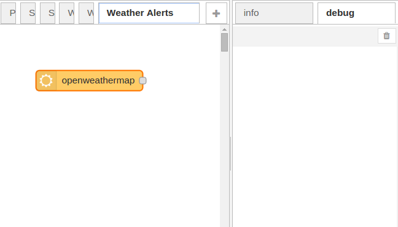

# Node-RED:2 -建立你的第一个流

这节课将介绍Node-RED可视化工具,让你开始建立你的第一个流。您将学习如何创建简单的流动,通过使用调试节点跟踪消息流和如何使用函数节点编写简单的JavaScript代码,调整节点以适应您的具体需求。

建立你的第一个流这节课将介绍Node-RED可视化工具,让你开始建立你的第一个流。您将学习如何创建简单的流动,通过使用调试节点跟踪消息流和如何使用函数节点编写简单的JavaScript代码,调整节点以适应您的具体需求。


Node-RED 界面
一旦你打开Node-RED,你会看到标准的Node-RED 界面，其中包括三个主要的窗格,如2.1图所示


图2.1 Node-RED 界面 -显示节点板(左),流界面(中心)和输出窗格(右)

主要控制流创建的工作区在中间。这里你可以拖拽节点并将他们用一根线连接起来。在工作区面板的顶部是一组选项卡。每个选项卡打开之前创建的工作区和用工作区显示创建的任何流。

左边窗格包含所有内置的Node-RED实例支持的节点。在上面的例子中,你看到的FRED节点集包含添加到带有Node-RED的基本设置的一个大的选择。在以后的课程您将了解这些节点和使用它们来开发新的流。你可以看到节点被分类。开放一个类别显示了单个节点。

右边是输出窗格,可以切换到infoand debugtabs。当信息被选中时,显示所选节点的文档。当debugis选中时,它将显示调试的输出节点,错误和警告。

以上这三个主要的窗格是常用的工具栏,右边是三个小部件,部署按钮,一个用户信息图标按钮和一个下拉菜单的管理和控制按钮。稍后在后面的课程中您将详细了解下拉按钮。用户信息图标允许你返回到FRED首页，它包含教程的链接,您的帐户信息,状态和其他信息以及注销的FRED服务。

使用Deploy按钮时流结构已经构建完成,它能使流部署到Node-RED系统并执行。你在第5课会了解到幕后实际发生的细节。现在只是把Deploy按钮当做让你流运行的方式。
快速的浏览一下Node-RED节点和消息
第1课中你可以看到,Node-RED允许您连接节点以创建流执行您的编程任务。节点之间的消息传递,从输入节点处理节点到输出节点。让我们简要地看一个节点,流和消息。

有三个主要类型的节点:

1. 输入节点(例如inject)
2. 输出节点(如debug)
3. 处理节点(例如function)


图2.2主要类型的节点:输入、输出和处理

输入节点允许您输入数据到Node-RED应用程序或"流"中。他们至少有一个输出端点所代表的只在右边显示的灰色小方格。你使用输入节点从其他服务器中连接数据,例如Twitter,Google,serial,websocketsor tcp节点,或者使用injectnode手动输入数据到流中。

输出节点允许你发送数据到Node-RED流外。他们的左侧有单独一个输入的端点。你使用输出节点发送数据到其他服务器,例如通过Twitter,tcp、serial 或邮件节点,或使用debugn节点输出到debug窗格。

处理节点允许您处理数据。他们有一个输入端点和一个或多个输出端点。它们允许您将数据类型(例如json,csv,xml)节点,使用数据触发消息(如trigger、delay)节点和使用接收到的数据(例如function节点)编写自定义代码。

请注意,某些节点,比如injectand debugmessages,有一个按钮,允许你开动一个节点(在使用inject节点的情况下)或启用和禁用节点(在debug节点的情况下)。

流包含连接在一起的多个节点,使输出标签和下一个流的节点的输出标签相连。节点中的消息流携带数据从一个节点到另一个节点。
Node-RED节点接收输入消息和产生输出消息。消息是JavaScript对象，它包含至少一个"有效载荷"参数,如下:
代码2.1基本Node-RED消息结构

```javascript
msg = {
  payload:"message payload"
};
```

节点接收和产生信息,通常使用msg。有效载荷是接收和产生的数据的主要占位符。并且，消息可扩展以包含其他参数。例如,设置消息的主题和添加一个新的参数,位置,您可以创建一个新的msg对象,如代码2.2所示。
代码2.2 更加复杂的Node-RED消息结构

```javascript
msg = {
  payload:"message payload",
  topic:"error",
  location:"somewhere in space and time"
};
```

## 示例2.1 第一个流 Hello World

我们用这些知识来创建您的第一个流。
示例2.1建立你的第一个流:Hello World
让我们继续,开始建立你的第一个流,这样您就可以看到使用Node-RED UI构建和部署流是多么简单。

让我们从最简单的开始流,一个节点注入一些信息到流中,连接到调试节点看到流的输出调试信息。一旦运行,您将构建完整的Hello World流。

因为这是第一次我们向你展示如何建立一个流,让我们慢慢开始,用截图解释每个步骤。一旦您创建了您的第一个流并看到这是多么容易,你大多会只显示最后整个流程的照片,而不是所有的屏幕截图。

让我们从最简单的节点开始,注释节点。你会在节点控制面板的function部分找到它。拖拽注释节点到流工作区,如图2.3所示。

图2.3:使用注释节点是添加可见的注释到流的好方法。

一旦你这么做了,看看右边的信息窗格(如果调试选项卡被选中，记住转换信息)。你会看到一个节点上的小信息,包括节点名、一个惟一的ID,一个描述节点的属性字段。commentnode没有太多要说的; 然而,更复杂的节点有更多的信息。

双击注释节点,您将看到一个配置窗口(图2.4)如果你喜欢可以给注释节点一个名字并添加详细的文本。

图2.4给comment一个名称,然后在文本框中添加任何你想要的信息
ok,现在让我们添加第一个确实有些用的节点,注入节点。注入节点用于生成输入流,是节点控制面板input中的一个节点。如果你拖拽一个注入节点到流工作区,然后看看info选项卡,您将看到注入节点的文档。注意,工作区中节点的名称更改为injectto时间戳,因为从1月1日,1970年开始节点的默认行为是注入一个时间戳,以毫秒为单位的当前时间。

图2.5 injectnode允许您插入事件消息,默认时间戳

您还会注意到,injectnode(现在叫timestamp)右上方有一个蓝点、右侧有一个灰色的方块。蓝点表示节点自上次改变尚未部署; 灰色的方块是输出节点。这就是你附加"连线"输出消息从注入节点路由到流中的下一个节点。

为感受注入节点和了解整个流程部署过程,让我们添加一个debugnode看看会发生什么,把它们连接在一起,然后部署流程和测试它。

先拖动debugnode从节点板到工作区。你还可以再看看该节点的信息。

然后你将两个节点连接在一起。为此,点击灰色injectnode输出点,按住鼠标按钮,拖向debugnode。一个橙色线出现,附着在debugnode上的灰色输入点。

图2.6从inject节点到debug节点布线

这是最简单的流动,将在debugnode的调试面板显示当前的时间戳。让我们试一试!

在Node-RED窗口中单击deploy按钮(右上角)。你会看到一个弹框显示流已经部署成功。你还会注意到节点上的蓝点消失,表明部署没有变化。
现在,在你试流之前,确保右边窗格的调试选项卡被选中。然后单击injectnode左边的选项卡,看看什么出现在调试面板。

图2.7从你第一次流调试输出--当你点击inject节点。

如您所见,injectnode,当点击时,会生成一个时间戳(1970年1月1日以来的毫秒数),通过输出线转换为一个消息并发送,传递给debugnode作为输入信息。debugnode的默认行为是显示其所接收到的任何消息,在它右边的debug窗格中显示。

恭喜,您创建并部署第一个流!

现在让我们增加一点,看看用这个简单的流我们可以做什么其他的事。首先,我们将编辑injectnode传递一条短信而不是一个时间戳。为此,选择流中的injectnode并双击它。你会看到一个如图2.8的配置窗口。

图2.8编辑一个inject节点发送文本,而不是一个时间戳

在payload字段中,选择字符串而不是时间戳,然后键入任何你喜欢的字符串到payload字段下面的空白处。根据传统,让我们从"Hello World--from my first NR flow"开始。

一旦你做出了改变,单击ok保存更改并看看流工作区。你会看到蓝色的点已经出现在injectnode(这也回到了被称为inject而不是timestamp),表明您未部署更改。再次单击deploy按钮来解决,然后点击injectnode中的tab。如果你看看debug输出你会看到,不再是一个时间戳（timestamp）,而是文本传递给debugnode作为消息,像往常一样显示。

图2.9发送一条信息,而不是一个时间戳（timestamp）

正如您可以看到的,很容易连接一些简单的节点和通过你的消息流获取数据。在这个阶段,你可能会想知道一些关于节点之间的消息流动。debug节点可以用来检查他们的更多细节。

Node-RED有三个默认的属性: 我们上面看到的payload,一个消息的主题,它是一个用户定义的字符串来描述消息是有关什么的(它的主题,如果你愿意)和内部标识符。你可以确实地看到这些信息如果你编辑debugnode配置。让我们试一试再看看输出(图2.10)


选择debugnode,双击,改变节点的输出字段"Complete msg object"(完整的msg对象)。如果你然后保存这个,部署并单击injectnode,您将看到在debug（调试）窗格中一个JSON结构,它包含三个字段:一个"topic"（主题）,目前是空白,"payload"，它包含的字符串设置inject节点和一个内部ID字段"_msgid"。一般不使用内部消息ID字段。但是,在开发流中topic（话题）和payload都是广泛使用。稍后您将看到更多的系列课。

这些字段是可扩展的,所以您可以定义新的消息属性,例如,msg。位置,这可以根据消息来源增加纬度和经度值的。让我们看一看,在下一个示例中的流。

你能找到这个流的node-red描述:

```json
[{"id":"50afa3ae.af505c","type":"inject","name":"","topic":"","payload":"","payloadType":"date","repeat":"","crontab":"","once":false,"x":108.09944152832031,"y":114.09091186523438,"z":"d0851e69.2f7ae","wires":[["c0ca81c9.3f358"]]},{"id":"93144b54.6cebb8","type":"comment","name":"My first NR Flow","info":"Title\n=====\n\nMarkdown is accepted:\n\n```\nnode.log(\"Code styling made easy\")\n```","x":108.09944152832031,"y":63.090911865234375,"z":"d0851e69.2f7ae","wires":[]},{"id":"c0ca81c9.3f358","type":"debug","name":"","active":true,"console":"false","complete":"false","x":310.0994415283203,"y":142.09091186523438,"z":"d0851e69.2f7ae","wires":[]}]
```

## 示例2.2第二个流:

天气警报
在这个例子中,这类似于一个第1课中介绍的例子,您可以监视你家乡的天气,当天气不错的时候可以给自己发一个tweet。
首先你需要在OpenWeatherMap得到一个API密匙。OpenWeatherMap提供一个强大的服务,为全球提供详细的天气信息。访问http://openweathermap.org/appid 并按照说明如下截图所示。


你需要注册一个OpenWeatherAccount，如下所示:


注册后页面将跳转到你的主页,在此您将能够访问或重新生成API。它看起来应该是这样的:

现在,让我们使用API建立天气预警流。从左侧窗格拖拽一个weather（天气）节点到工作区,如图2.11所示。

图2.11。将weather（天气）节点拖放到工作区的空白部分。

如果您选择右边的信息窗格,您可以看到描述openweathermapnode中如何配置和使用它的详细信息。一些有趣的注意事项:

它有一个完整的JSON结构作为msg。payload（有效载荷）,有着相当多的天气细节,所有提交的名字:值对,例如风速和tempc（摄氏温度）
节点定义了3个新消息属性,msg。location，msg。time 和msg.data。正如上面提到的,您可以自由添加属性信息,并且openweathermapnode已经添加这些新属性以携带有关的额外信息。

让我们配置节点和看看查询当地的天气后它生成实际的数据结构。首先双击节点和填写你的位置相关的表格。输入你的城市和国家。添加您获得API http://openweathermap.org/appid 并点击"Ok",

如图2.12所示。

图2.12。你在上面的步骤中获得的使用API在配置中设置你的城市和国家。

然后拖拽一个debugnode把它和openweathermapnode连起来。点击"部署"以查看在调试面板中从openweathermapnode得到的payload对象。

代码2.3 openweathermapnode的消息有效负载（payload）是一个描述天气状况、温度、风力、云量和日出的JSON结构。

```javascript
{
  "weather": "Clear",
  "detail": "sky is clear",
  "tempk": 295.104,
  "tempc": 21.903999999999996,
  "humidity": 53,
  "maxtemp": 295.104,
  "mintemp": 295.104,
  "windspeed": 2.22,
  "winddirection": 273.007,
  "location": "Vancouver",
  "sunrise": 1432038196,
  "sunset": 1432094081,
  "clouds": 8,
  "description": "Vancouver weather(49.25,-123.12) is Clear (sky is clear)."
}
```

正如您所看到的,该节点提供了相当多和你当地的天气相关的信息,所有常见的名字:值对。对于这个示例,您想要使用你要测试是否报道"Clear"（清楚）的"天气"字段。如果是"Clear"（清楚）你会发送一条tweet。
为检验程序的逻辑,您将使用一个functionnode。你在第1课中看到其中之一,但没有细节。让我们看看如何通过拖拽一个到流中使用它们和如何双击它以打开node编辑器。

图2.13。添加一个functionnode并将它连接到openweathermap节点。现在双击functionnode和打字/复制(注意,如果你使用复制/粘贴,确保你粘贴的是普通文本,wordpress有时插入奇怪的字符)

代码2.4Function node"天气是否清楚"。

```javascript
if (msg.payload.weather === "Clear") {
    msg.payload = "Clear skies ahead today!"
    return msg;
}
return null;
```


图2.14。编辑节点添加如代码2.4所示的JavaScript。

从代码2.4中,您可以看到,这将为解析传入的消息有效负载中的天气参数并比较的字符串"Clear"(第1行)。如果它们相等,它将用你自己的字符串的消息有效负载"Clear skies ahead today!" (第2行)改写原来文本。否则,它将返回一个空消息(第5行)。最后一点很重要,因为在Node-RED节点中忽略空消息。

你现在可以做各种各样的事情,例如将它和emailnode或pushbulletnode相连。在本教程中我们将使用Twitter的输出节点。将Twitter节点拖到工作区,双击,填写你的Twitter帐户,如图2.15所示。

图2.15。设置你的Twitter帐户到节点配置中

一旦你设置这些凭据,Node-RED存储它并且将来当您创建另一个Twitter节点时你可以重用他们。一旦你连接上了流,可以点击deploy按钮,然后盯着你的Twitter账户，当每次天气报告为"Clear"时你的Twitter帐户能看到新的tweet。
点击"部署"（Deploy）:

图2.16。天气监测流发送tweet如果天气报告提到晴朗的天空。

其他有用的UI特性
Node-RED UI最有用的功能之一是能够复制粘贴节点甚至全部的流都可以如此使用。Node-RED流只是简单编码为JSON字符串并可以使用Node-RED窗口右上角的下拉菜单从一个工作区导出并导入到另一个工作区。

在这个例子中不是构建流,或事实上在这个系列课,自己动手,从我们的网站您可以简单地将它们复制粘贴到一个工作区中。之后所有你需要做的就是正确配置它们,例如凭证,并部署（deploy）它们。

让我们快速告诉你怎么做。

点击这个例子末尾的链接并找到JSON代码。使用通常的CTL+C将其复制到剪贴板 或复制在编辑菜单项。使用Node-RED窗口中右上角的下拉菜单,选择Import - >Clipboard,如图2.17所示。

图2.17在Node-RED选择从剪贴板菜单项导入

你将看到弹出一个输入字段(图2.18)。将剪贴板粘贴到输入窗口并单击OK。

图2.18粘贴流到Node-RED导入窗口

新流程将出现在当前工作区中,可以被扔到一个位置。一旦到位,你可以任你所想地配置它，创建你自己的流并部署它（deploy）。

你能找到这个流的node-red描述: 

```json
[{"id":"3b4275ef.c4bd8a","type":"openweathermap in","name":"","lon":"","lat":"","city":"","country":"","x":141.0994415283203,"y":284.0909118652344,"z":"d0851e69.2f7ae","wires":[["b766183d.4899e8"]]},{"id":"b766183d.4899e8","type":"function","name":"","func":"if (msg.payload.weather === \"Clear\") {\n    msg.payload = \"Clear skies ahead today!\"\n    return msg;\n}\nreturn null;","outputs":1,"noerr":0,"x":268.0994567871094,"y":344.0909118652344,"z":"d0851e69.2f7ae","wires":[["c221838c.3dde8"]]},{"id":"c221838c.3dde8","type":"twitter out","name":"Tweet","x":393.0994415283203,"y":391.0909118652344,"z":"d0851e69.2f7ae","wires":[]}]
```

# 总结

这节课你已经创建了第一个流和看到如何连接一组基本节点以实现非常复杂的任务。我们跳过一些底层的细节为了让你更快get到那个点,我们会在第3、4课的时候会再次返回这些例子。然而,至今您已经目睹了Node-RED如何生成流,基本类的输入、输出和处理。你简要复习消息（message）以及如何使用函数节点编写自己的JavaScript代码在消息流内以简单的处理它。在下一课,你将更深入看Node-RED的编程模型,得到一个更好的理解的主要编程元素和节点以及如何使用多种节点制作更复杂的流。


